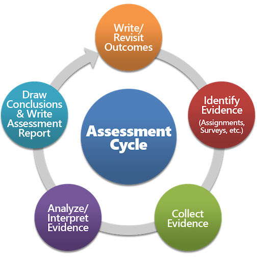

```{r setup, include=FALSE}
knitr::opts_chunk$set(echo = FALSE, fig.align = "center")
```
## Objectives  
1. Describe the process used for General Education assessment at Ferris State University
2. Provide access to all of our assessment resources
3. Demonstrate several mechanisms for involving faculty in the assessment process

## Presentation Handouts
* PDF versions are available online <br /><br />

* <a href="http://www.reproducibleassessment.com/IUPUI2017/handout.pdf", target="_blank">QR codes and website information</a>
* <a href="http://www.reproducibleassessment.com/IUPUI2017/Training_Handout.pdf", target="_blank">Training handout and standard measures</a>

## About Ferris State
<div id="left">
* West Central Michigan
* Medium Masters University
* 14,600 students
* Recently Revised General Education
* Opportunity to embed assessment

</div>
<div id="right">
<section class = "plain">
 
</section>

## General Education Assessment
* **Goal:** Track and improve program effectiveness <br />  

	>* Our program primarily consists of courses
	>* Embedded course assignments are the most meaningful and valid measures of student learning.
	>* General Education applies to all students<br />  
	
>* **Therefore, we are measuring student performance in General Education using embedded assessments for all students in all courses.**

## Project Scope
* In a typical semester, General Education at Ferris: <br />

	>* Offers over 400 different courses
	>* Instructs over 5,000 individual students
	>* Involves over 500 different faculty
	>* Generates over 50,000 student credit hours
	>* Is responsible for $20,000,000 in revenue

## Project Resources
>* Program coordinator (me, 50% release)
>* General Education Committee (advisory, no release)
>* Line item budget ($0)
>* Dedicated staff (none)
>* Other staff (Registrar and IR)

## The Assessment Cycle
<section class = "plain">

</section>

## The Futile Cycle
<section class = "plain">

</section>

## A Better Model
<blockquote>"Assessment is not a spreadsheet -- it is a conversation"<br />Irmeli Halinen</blockquote>
<section class = "plain">

</section>

## Reproducible assessment
<blockquote>Our goal is to create reproducible processes to increase transparency and <em>encourage faculty engagement</em>.</blockquote>  

* **ALL** assessment resources are public-facing  <br />  

	>* Data reports (PDF and HTML)
	>* Data analysis code (R)
	>* Deidentified data files (csv)<br />

>* All released with MIT or CC-BY licenses  
>* All results are computationally reproducible and extensible

## Striking a balance

<div align = "center">Faculty ownership vs. Chaotic data catastrophe</div>
<section class = "plain">

</section>

## Sustainable assessment
* The three keys to our program assessment strategy: <br /><br />

>1. **Simplification** — reduce complexity  
>2. **Standardization** — reduce variance
>3. **Automation** — reduce workload


## Simplify: Core Competencies  
* Eight competencies: <br />  

>* Collaboration, Communication, Culture, Diversity, Natural Sciences, Problem Solving, Quantitative Literacy, Self and Society  
>* Each overseen by a faculty subcommittee (6-10 members)  <br /><br />  

  >1. Operational definitions  
  >2. Goals (<a href="https://ferris.edu/HTMLS/academics/general-education/competencies/hallmarks.htm" target="_blank">Hallmarks of a Bulldog</a>)  
  >3. Relevance statements  

## Simplify: Ferris Learning Outcomes
>* Each competency has four learning outcomes
>* Based upon what we want our graduating seniors to look like
>* Derived from LEAP 
>* One outcome measured each semester
>* <a href="https://ferris.edu/HTMLS/academics/general-education/evidence/schedule.htm", target="_blank">Rolling two-year program cycle</a>   

## Standardize: Rubrics
* Derived from VALUE rubrics  
* <a href="http://www.reproducibleassessment.com/1701/", target="_blank">General Education now has a uniform</a>: <br /><br />  

>1. Scoring system (zero to four point scale)  
>2. Analysis interpretation (four threshold values)  
>3. Criterion leveling (expectations by course level)  

## Standardize: Measures
* Created in order to get more uniform data collection and summarization

>* 14 different type of measures are defined  
>* Instructors can choose to use any one they wish <br /><br />  

>1. Exams
>2. Products
>3. Performances

## Standardize: Registering Courses
* I need to know who is doing what each semester

>* Who is collecting data?
>* What competency is being measured?
>* What outcome is being measured?
>* What measure is being used?
>* All tracked using a Google form

## Standarize: Data Collection
* <a href="https://ferris.edu/HTMLS/academics/general-education/procedures/forms/workbooks/index.htm", target="_blank">This is the biggest step forward for us</a>

>* Excel workbooks to collect and summarize student results
>* SCORE, PREPOST, NORM, RUBRIC
>* Common metadata supplied by instructors
>* Enter student names, IDs, and appropriate evaluations
>* A standaridized summary is automatically generated

## Standardize: TracDat Assignments
* Seeking to minimize the need for faculty to log into TracDat

>* Received as an email
>* Copy and paste summary
>* Select a few responses from drop-down menus
>* Add a short reflection
>* Attach the workbook and submit

## Automate: Analysis of Student Data
* All workbooks are stored in the TracDat document repository

>* Each semester's data is in a separate folder
>* Download all the workbooks
>* An R script is used to process the workbooks
>* All data is aggregated into one csv file
>* Identifiable information is removed

## Automate: Reporting

>* Using R and bookdown (Rmarkdown)  
>* Reuseable, version-controlled code  
>* PDF reports for printing  
>* HTML reports for distribution and collaboration  

## Assessment in Action
* **Five means of creating a dialog:** <br /><br />  

>1. <a href="http://www.reproducibleassessment.com/1601/report-1601.pdf", target="_blank">Print reports for dissemination</a>  
>2. <a href="http://www.reproducibleassessment.com/1601/", target="_blank">Online forums for extended discussions</a>  
>3. <a href="https://doi.org/10.17605/OSF.IO/35GSR", target="_blank">OSF projects as the ultimate home base</a>  
>4. <a href="http://github.com/weebeasties/1601_SCI1", target="_blank">GitHub repositories for reproducibility</a>  
>5. <a href="https://weebeasties.shinyapps.io/Dashboard", target="_blank">Executive dashboard for overviews</a>  

## Summary

>* We are creating a _collaborative_ assessment environment  
>* This is more about **process** than **personality**  
>* Focus is on making a **resource** rather than just **reports**    

## Questions?

* All of these resources are linked to from your handouts  
* Licensed using either CC-BY 4.0 or MIT  
* Feel free to contact me if you have questions or comments  

<section class = "plain">
 
</section>
